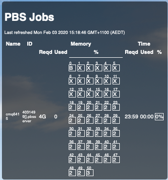

# PBS Job Monitor Widget

This widget allows you to monitor the status of HPC jobs submitted on PBS 
systems from your desktop, at a glance, without having to fiddle with `qstat`,
and reading through full job displays to understand what's happening. 



__This has been tested on PBS Pro 13 only.__

In order to make it compatible with other PBS Releases (Including those that
natively support job outputs in JSON formatting), the server-side commands may
need to be adapted to ensure that the output matches the API expected by the client.

It is possible that the `qstat -f` API has remained stable since PBSPro 13, but
I can't say for sure.

Additionally, the environment modules provided by your HPC system may vary, and 
the server-side scripts expect python >= 3.7 in order to function correctly. 

## Installation

Installation takes 3 steps for this widget, the first is to install the server-side commands (Found in `./bin`). 

The next step is to install the contents of `PBSJobMonitor.widget.zip` to your Uberischt widgets directory.

Finally, you should ensure that you have an ssh public/private key pair between
your local machine and your hpc login, so that you are not prompted for a password when you ssh in.

### Installing server side commands

To do this, from an SSH session in your hpc, clone this repo to somewhere in your
HPC's home folder (Anywhere is fine, as long as you can add it to path).

For example:

#### Cloning the repo

```bash
cd ~

git clone https://github.com/mstr3336/job-monitor-widget.git
```

#### Adding the server-side commands to your PATH

Now you need to add the contents of `./bin` to your path. 

Do this in your `.bashrc`. (Assuming you cloned the repo to 
`~/job-monitor-widget`)

Add the following line:

```bash
export PATH="${PATH}:~/job-monitor-widget/bin"
```

#### (Optional) Ensuring your system can run the commands

HPC systems vary, and my script expects that yours will allow loading of 
environment modules using `module load`. 

Additionally, it expects that `python/3.7.2` is an available module for your system.

If your system does not have `python 3.7.2`, any version of python >= 3.7 will do.

Change the line containing `module load python/3.7.2` to whatever version of python >= 3.7 your system supports. 

If this is not possible on your system, but your system does support singularity containers, you may be able to use a singularity image to run the server-side commands.

### Installing the client-side widget

Extract `PBSJobMonitor.widget.zip` into `your-uberischt-widgets-dir/PBSJobMonitor/`. 

You will need to change some parameters to match your username and server.

Modify the following in `pbs-monitor.jsx` :

```js
const info = {
  'username'  : 'mstr3336',
  'job_owner' : 'mstr3336',
  'server'  : 'hpc.sydney.edu.au'
}
```
Change 'username' from 'mstr3336' to whatever your HPC login account is. 
Change 'job_owner' to the account name of the user you want to monitor. 
This will likely be the same value you set for 'username'.

Change 'server' to whatever the address of your hpc login server is.

### Setup Public Key Auth between your local computer and the host

This is a handy thing to do to save time when ssh-ing from your local PC to
a server you use often in any case. 

Follow any guide on the subject, such as [this one]](https://www.linode.com/docs/security/authentication/use-public-key-authentication-with-ssh/) to set this up.

